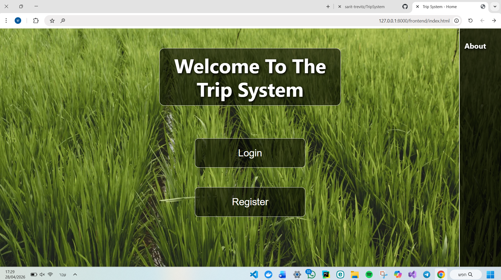
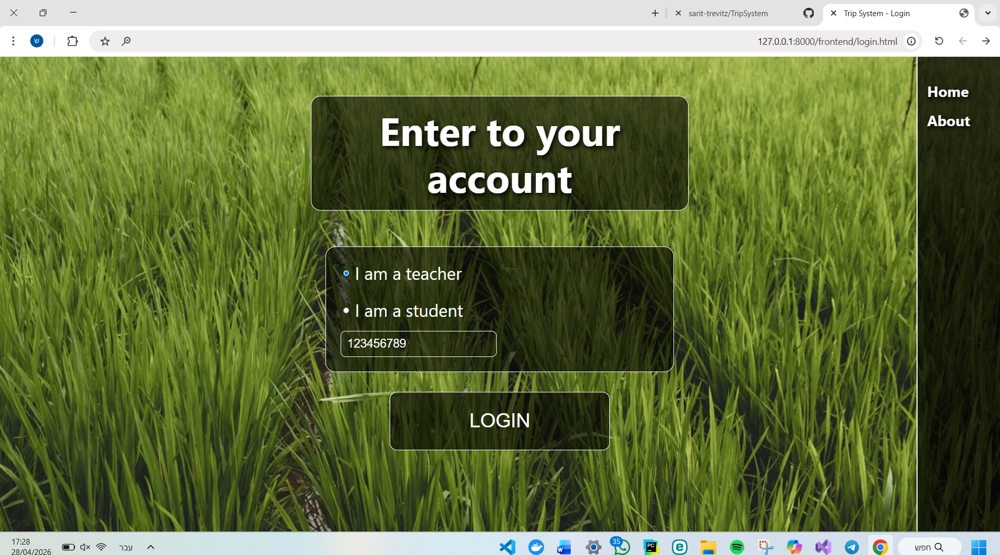
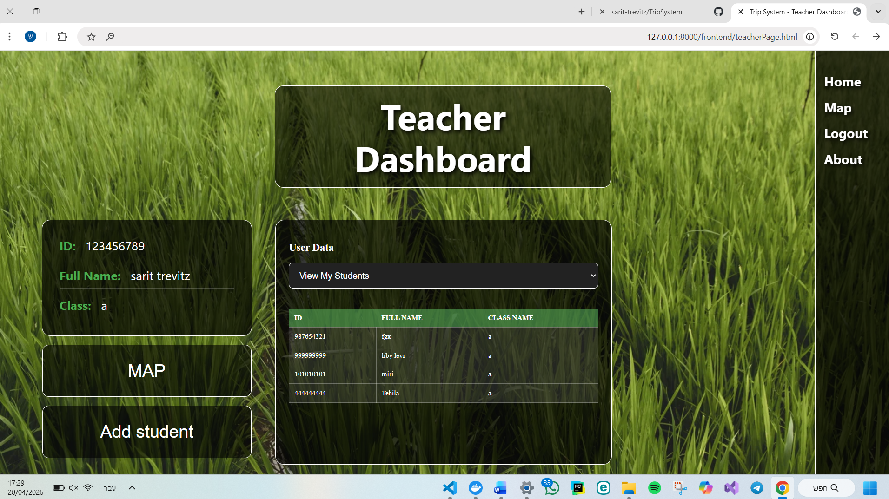
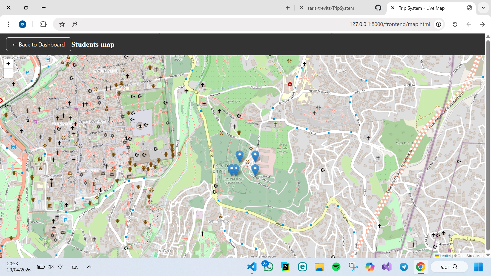

**Trip  System**

## **Overview**

The system was developed as a solution for managing the school's annual trip.

It is designed to allow teachers to have full control over student data and continuous safety monitoring.

## **Key Features**

_Registration and management:_ Separate registration for teachers and students.

_Registration and management:_ Separate registration for teachers and students.

_Viewing data:_ Only teachers have access to view lists of students, teachers, or only the students in their class.

_Real-time location:_ Receiving GPS data from location devices in JSON format.

_Real-time location:_ Receiving GPS data from location devices in JSON format.

_Map:_ Displaying the last location of each student on an interactive map that updates automatically.

## **User interface (UI/UX)**

The system was designed in a modern and clean style with an emphasis on ease of use:

_Right navigation:_ All pages of the system have a fixed navigation bar on the right side that allows quick navigation on the site.

_Right navigation:_ All pages of the system have a fixed navigation bar on the right side that allows quick navigation on the site.

_Customized display:_ The interface changes depending on the type of user (teacher or student) and displays only the relevant actions.

## **Technologies**

**Backend:** python with FastApi

**Database:** SQLLite

**Frontend:** HTML5, CSS3, JavaScript

## **Installation and Setup**

_Prerequisites:_ Install Python 3.8+.

_Launch steps:_

1. _Extract the project:_ Extract the solution ZIP file.

2. _Install libraries:_ pip install fastapi uvicorn sqlalchemy.

3. _Launch:_ uvicorn main:app --reload.

4. _Access:_ Go to http://127.0.0.1:8000.

## **Project Assumptions**

_Security:_ The system simulates permissions based on the browser's memory.

_Conversion to coordinates:_ The system performs a mathematical conversion of the DMS format. 

_Update frequency:_ The map is updated against the server every 30 seconds to ensure accuracy without overloading the resources.

## **Screenshots**

### **Home Page**

### **Login Page**

### **Teacher Dashboard**

### **Live Student Map**

